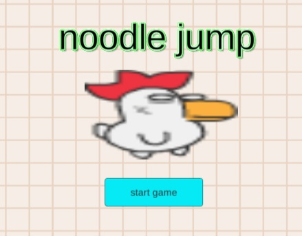
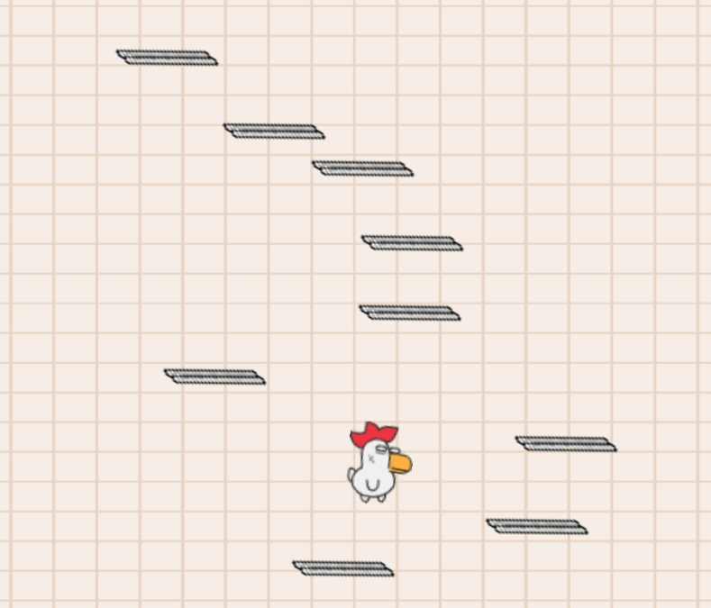
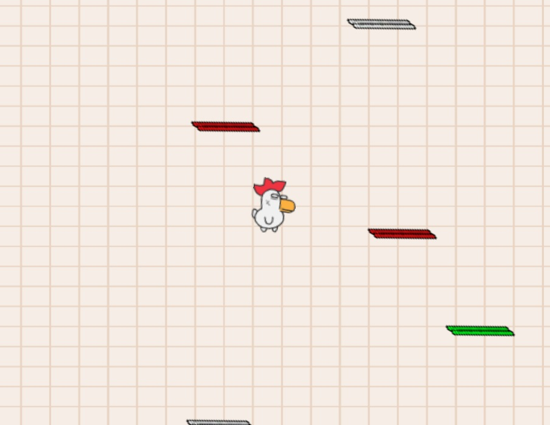

# HW5-NoodleJump

link to itch.io - https://to-gaming.itch.io/noodlejump

## ScreenShots 

## About the game-
* you are a crazy chicken.
* jump on the chopsticks to run away.
* move yourself using the arrows.
* be carefull not to fall down or you'll have to start again.
* pass the 3 levels to win the game.

## Details:
how we made this game:
* control scripts: 
  * mover.cs - take player rigidbody and move it horizontaly with arrow keys (and make velocity in runtime).
  * follow.cs - makes the camera follow the player along the gameplay(and ends the game when player reaches the bootom).
  * Newosci.cs - according to chosen speed, moves an object on the X axis(right and left).
  * levels.cs - Generates platfoms according to prefference (difficulty changes when progressing)
  * platfom.cs - makes the platform jumpable ( adds velocity when collide from up relatively)
  * nextlevelwin.cs - script to move to the next level (on collide)

## Credits:
 Lima Sky - Game developers of DoodleJump
